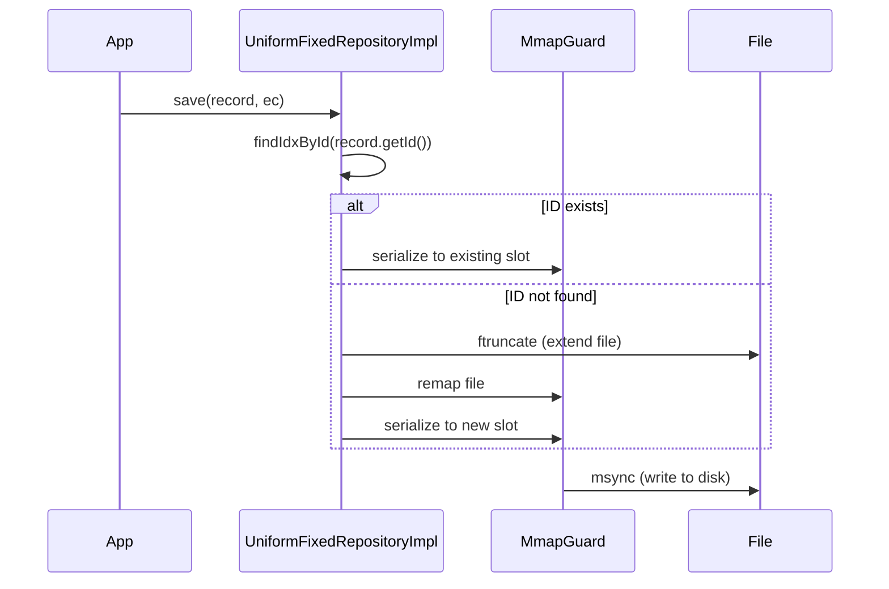

# PosixCppFdFileLibrary (FdFileLib)

A high-performance C++ file repository library using POSIX APIs (`open`, `read`, `write`, `fsync`) and `mmap` for efficient I/O. Supports both **Variable-Length (JSON-like)** and **Strict Fixed-Length (Binary)** record formats.

## Features

| Feature | Description |
|---------|-------------|
| **High Performance** | Direct POSIX I/O with `mmap` for O(1) random access on fixed-length records |
| **Zero Vtable Overhead** | CRTP (Curiously Recurring Template Pattern) eliminates virtual function costs |
| **C++17 Tuple-Based** | Modern field metadata system using `std::tuple` and fold expressions |
| **RAII Safety** | Automatic resource cleanup for file descriptors and memory mappings |
| **Upsert Semantics** | `save()` automatically inserts or updates based on record ID |
| **GoogleTest Integration** | Comprehensive unit tests with CTest support |

## Project Structure

```
posixCppFdFileLibrary/
├── CMakeLists.txt              # Root CMake (includes GoogleTest)
├── compile.sh                  # Build script
├── run.sh                      # Run example script
│
├── fdFileLib/                  # Core Library
│   ├── CMakeLists.txt
│   ├── record/
│   │   ├── RecordBase.hpp          # Base interface
│   │   ├── VariableRecordBase.hpp  # Variable-length (Virtual)
│   │   ├── FixedRecordBase.hpp     # Fixed-length (CRTP)
│   │   └── FieldMeta.hpp           # C++17 tuple-based field metadata
│   ├── repository/
│   │   ├── RecordRepository.hpp            # Repository interface
│   │   ├── VariableFileRepositoryImpl.hpp  # Variable-length repo
│   │   ├── VariableFileRepositoryImpl.cpp
│   │   └── UniformFixedRepositoryImpl.hpp  # Fixed-length repo (Header-only)
│   └── util/
│       ├── UniqueFd.hpp        # RAII file descriptor
│       ├── MmapGuard.hpp       # RAII mmap wrapper
│       ├── FileLockGuard.hpp   # File locking
│       └── textFormatUtil.hpp  # JSON-like parsing/formatting
│
├── examples/                   # Usage Examples
│   ├── main.cpp                # Comprehensive demo
│   └── records/
│       ├── FixedA.hpp          # Fixed record example A
│       ├── FixedB.hpp          # Fixed record example B
│       ├── A.hpp               # Variable record example A
│       └── B.hpp               # Variable record example B
│
└── tests/                      # GoogleTest Unit Tests
    ├── CMakeLists.txt
    ├── FixedRecordTest.cpp     # 14 tests
    ├── VariableRecordTest.cpp  # 11 tests
    └── UtilTest.cpp            # 17 tests
```

---

## Getting Started

### Prerequisites
- **C++17** compliant compiler (GCC 7+, Clang 5+, MSVC 19.14+)
- **CMake** 3.16+
- **POSIX** environment (Linux/macOS)

### Build

```bash
# Clone and build
git clone <repo-url>
cd posixCppFdFileLibrary

# Build (GoogleTest will be downloaded automatically)
mkdir build && cd build
cmake ..
cmake --build . -j

# Or use the provided script
./compile.sh
```

### Run Tests

```bash
# Run all 42 unit tests
cd build && ctest --output-on-failure

# Run specific test suite
./build/fdfile_tests --gtest_filter="FixedARepositoryTest.*"

# Run specific test
./build/fdfile_tests --gtest_filter="VariableRepositoryTest.UpdateExistingRecord"
```

### Run Example

```bash
./run.sh
# or
./build/fdfile_example
```

---

# [English] Usage Guide

## 1. Fixed-Length Records (Recommended)

Fixed-length records provide **O(1) read/write by index**, **data integrity**, and **zero virtual function overhead**. Ideal for high-frequency data storage.

### Step 1: Define Your Record Class

Inherit from `FdFile::FixedRecordBase<T>` (CRTP pattern) and use the `FD_RECORD_IMPL` macro.

```cpp
#pragma once
#include "record/FieldMeta.hpp"
#include "record/FixedRecordBase.hpp"
#include <cstring>

class User : public FdFile::FixedRecordBase<User> {
public:
    char name[20];    // Fixed 20 bytes for name
    int64_t age;      // 19 digits (padded with zeros)

private:
    // Define field metadata as a tuple
    auto fields() const {
        return std::make_tuple(
            FD_STR(name),  // String field
            FD_NUM(age)    // Numeric field (int64_t, 19 digits)
        );
    }

    // Initialize members to zero
    void initMembers() {
        std::memset(name, 0, sizeof(name));
        age = 0;
    }

    // Generate common methods (constructor, getId, setId, typeName, etc.)
    // Parameters: ClassName, TypeName, TypeLength, IdLength
    FD_RECORD_IMPL(User, "User", 10, 10)

public:
    // Custom constructor (optional but recommended)
    User(const char* n, int64_t a, const char* id) {
        initMembers();
        if (n) std::strncpy(name, n, sizeof(name));
        age = a;
        setId(id);
        defineLayout();  // Must call in custom constructor
    }
};
```

### Step 2: Use the Repository

```cpp
#include "repository/UniformFixedRepositoryImpl.hpp"

int main() {
    std::error_code ec;
    
    // Create repository (file will be created if it doesn't exist)
    FdFile::UniformFixedRepositoryImpl<User> repo("users.db", ec);
    if (ec) {
        std::cerr << "Init failed: " << ec.message() << "\n";
        return 1;
    }

    // INSERT
    User alice("Alice", 30, "001");
    User bob("Bob", 25, "002");
    repo.save(alice, ec);
    repo.save(bob, ec);

    // UPDATE (same ID = update)
    alice.age = 31;
    repo.save(alice, ec);  // Updates existing record

    // FIND BY ID
    auto found = repo.findById("001", ec);
    if (found) {
        std::cout << "Name: " << found->name << ", Age: " << found->age << "\n";
    }

    // FIND ALL
    auto all = repo.findAll(ec);
    for (const auto& user : all) {
        std::cout << user->name << " (id=" << user->getId() << ")\n";
    }

    // EXISTS
    bool exists = repo.existsById("001", ec);  // true

    // COUNT
    size_t count = repo.count(ec);  // 2

    // DELETE BY ID
    repo.deleteById("002", ec);  // Deletes Bob

    // DELETE ALL
    repo.deleteAll(ec);  // Clears all records

    return 0;
}
```

---

## 2. Variable-Length Records

Flexible JSON-like format suitable for configuration files or infrequent access patterns. Uses virtual function polymorphism.

```cpp
#include "record/VariableRecordBase.hpp"

class Config : public FdFile::VariableRecordBase {
public:
    std::string key;
    std::string value;

    Config() = default;
    Config(std::string k, std::string v) : key(std::move(k)), value(std::move(v)) {}

    std::string id() const override { return key; }
    const char* typeName() const override { return "Config"; }

    std::unique_ptr<FdFile::RecordBase> clone() const override {
        return std::make_unique<Config>(*this);
    }

    void toKv(std::vector<std::pair<std::string, std::pair<bool, std::string>>>& out) const override {
        out.clear();
        out.push_back({"key", {true, key}});
        out.push_back({"value", {true, value}});
    }

    bool fromKv(const std::unordered_map<std::string, std::pair<bool, std::string>>& kv,
                std::error_code& ec) override {
        auto k = kv.find("key");
        auto v = kv.find("value");
        if (k == kv.end() || v == kv.end()) return false;
        key = k->second.second;
        value = v->second.second;
        return true;
    }
};

// Usage requires prototype instances for deserialization
std::vector<std::unique_ptr<VariableRecordBase>> prototypes;
prototypes.push_back(std::make_unique<Config>());

FdFile::VariableFileRepositoryImpl repo("config.txt", std::move(prototypes), ec);
```

---

## API Reference

### `UniformFixedRepositoryImpl<T>`

| Method | Description | Complexity |
|--------|-------------|------------|
| `save(const T& record, std::error_code& ec)` | Insert or update record | O(N) search + O(1) write |
| `findById(const std::string& id, std::error_code& ec)` | Find record by ID | O(N) |
| `findAll(std::error_code& ec)` | Get all records | O(N) |
| `existsById(const std::string& id, std::error_code& ec)` | Check if ID exists | O(N) |
| `deleteById(const std::string& id, std::error_code& ec)` | Delete record by ID | O(N) |
| `deleteAll(std::error_code& ec)` | Delete all records | O(1) |
| `count(std::error_code& ec)` | Get record count | O(1) |

### Macros

| Macro | Description |
|-------|-------------|
| `FD_STR(member)` | Define a string field (char array) |
| `FD_NUM(member)` | Define a numeric field (int64_t, 19 digits) |
| `FD_RECORD_IMPL(Class, TypeName, TypeLen, IdLen)` | Generate common record methods |

---

# [Korean] 사용 가이드

## 1. 고정 길이 레코드 (권장)

고정 길이 레코드는 **O(1) 인덱스 기반 읽기/쓰기**, **데이터 무결성**, **Zero Virtual Function Overhead**를 제공합니다. 고빈도 데이터 저장에 최적화되어 있습니다.

### 단계 1: 레코드 클래스 정의

`FdFile::FixedRecordBase<T>`를 상속받고 (CRTP 패턴) `FD_RECORD_IMPL` 매크로를 사용합니다.

```cpp
#pragma once
#include "record/FieldMeta.hpp"
#include "record/FixedRecordBase.hpp"
#include <cstring>

class User : public FdFile::FixedRecordBase<User> {
public:
    char name[20];    // 이름 (20바이트 고정)
    int64_t age;      // 나이 (19자리, 0으로 패딩)

private:
    // 필드 메타데이터를 튜플로 정의
    auto fields() const {
        return std::make_tuple(
            FD_STR(name),  // 문자열 필드
            FD_NUM(age)    // 숫자 필드 (int64_t, 19자리)
        );
    }

    // 멤버 초기화
    void initMembers() {
        std::memset(name, 0, sizeof(name));
        age = 0;
    }

    // 공통 메서드 자동 생성 (생성자, getId, setId, typeName 등)
    // 매개변수: 클래스명, 타입명, 타입길이, ID길이
    FD_RECORD_IMPL(User, "User", 10, 10)

public:
    // 커스텀 생성자 (선택 사항이지만 권장)
    User(const char* n, int64_t a, const char* id) {
        initMembers();
        if (n) std::strncpy(name, n, sizeof(name));
        age = a;
        setId(id);
        defineLayout();  // 커스텀 생성자에서 반드시 호출
    }
};
```

### 단계 2: 리포지토리 사용

```cpp
#include "repository/UniformFixedRepositoryImpl.hpp"

int main() {
    std::error_code ec;
    
    // 리포지토리 생성 (파일이 없으면 자동 생성)
    FdFile::UniformFixedRepositoryImpl<User> repo("users.db", ec);
    if (ec) {
        std::cerr << "초기화 실패: " << ec.message() << "\n";
        return 1;
    }

    // 삽입 (INSERT)
    User alice("Alice", 30, "001");
    User bob("Bob", 25, "002");
    repo.save(alice, ec);
    repo.save(bob, ec);

    // 수정 (UPDATE) - 같은 ID면 업데이트
    alice.age = 31;
    repo.save(alice, ec);  // 기존 레코드 업데이트

    // ID로 조회 (FIND BY ID)
    auto found = repo.findById("001", ec);
    if (found) {
        std::cout << "이름: " << found->name << ", 나이: " << found->age << "\n";
    }

    // 전체 조회 (FIND ALL)
    auto all = repo.findAll(ec);
    for (const auto& user : all) {
        std::cout << user->name << " (id=" << user->getId() << ")\n";
    }

    // 존재 여부 확인 (EXISTS)
    bool exists = repo.existsById("001", ec);  // true

    // 개수 조회 (COUNT)
    size_t count = repo.count(ec);  // 2

    // ID로 삭제 (DELETE BY ID)
    repo.deleteById("002", ec);  // Bob 삭제

    // 전체 삭제 (DELETE ALL)
    repo.deleteAll(ec);  // 모든 레코드 삭제

    return 0;
}
```

---

## 2. 가변 길이 레코드

설정 파일이나 접근 빈도가 낮은 데이터에 적합한 유연한 JSON 스타일 형식입니다. 가상 함수 다형성을 사용합니다.

```cpp
#include "record/VariableRecordBase.hpp"

class Config : public FdFile::VariableRecordBase {
public:
    std::string key;
    std::string value;

    Config() = default;
    Config(std::string k, std::string v) : key(std::move(k)), value(std::move(v)) {}

    std::string id() const override { return key; }
    const char* typeName() const override { return "Config"; }

    std::unique_ptr<FdFile::RecordBase> clone() const override {
        return std::make_unique<Config>(*this);
    }

    // toKv(), fromKv() 구현 필요...
};

// 역직렬화를 위한 프로토타입 인스턴스 필요
std::vector<std::unique_ptr<VariableRecordBase>> prototypes;
prototypes.push_back(std::make_unique<Config>());

FdFile::VariableFileRepositoryImpl repo("config.txt", std::move(prototypes), ec);
```

---

## API 레퍼런스

### `UniformFixedRepositoryImpl<T>`

| 메서드 | 설명 | 복잡도 |
|--------|------|--------|
| `save(const T& record, std::error_code& ec)` | 레코드 삽입 또는 업데이트 | O(N) 검색 + O(1) 쓰기 |
| `findById(const std::string& id, std::error_code& ec)` | ID로 레코드 조회 | O(N) |
| `findAll(std::error_code& ec)` | 모든 레코드 조회 | O(N) |
| `existsById(const std::string& id, std::error_code& ec)` | ID 존재 여부 확인 | O(N) |
| `deleteById(const std::string& id, std::error_code& ec)` | ID로 레코드 삭제 | O(N) |
| `deleteAll(std::error_code& ec)` | 모든 레코드 삭제 | O(1) |
| `count(std::error_code& ec)` | 레코드 개수 조회 | O(1) |

### 매크로

| 매크로 | 설명 |
|--------|------|
| `FD_STR(member)` | 문자열 필드 정의 (char 배열) |
| `FD_NUM(member)` | 숫자 필드 정의 (int64_t, 19자리) |
| `FD_RECORD_IMPL(Class, TypeName, TypeLen, IdLen)` | 공통 레코드 메서드 생성 |

---

## Testing

### Unit Tests (GoogleTest)

이 프로젝트는 **GoogleTest**를 사용한 42개의 단위 테스트를 포함합니다:

| Test File | Tests | Description |
|-----------|-------|-------------|
| `FixedRecordTest.cpp` | 14 | FixedA/FixedB CRUD 테스트 |
| `VariableRecordTest.cpp` | 11 | Variable record (A/B) CRUD 테스트 |
| `UtilTest.cpp` | 17 | textFormatUtil 함수 테스트 |

```bash
# 모든 테스트 실행
cd build && ctest --output-on-failure

# 특정 테스트 스위트만 실행
./fdfile_tests --gtest_filter="FixedARepositoryTest.*"
```

---

## Architecture

### CRTP Pattern (Zero Overhead Polymorphism)

```
FixedRecordBase<Derived>
        ↑
        │ CRTP Inheritance
        │
      User (Derived)
```

- No virtual function table (vtable)
- Compile-time polymorphism via `static_cast<Derived*>(this)`
- All method calls are resolved at compile time

### Record Lifecycle



---

## License

MIT License - See [LICENSE](LICENSE) file.
